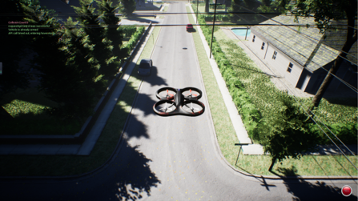
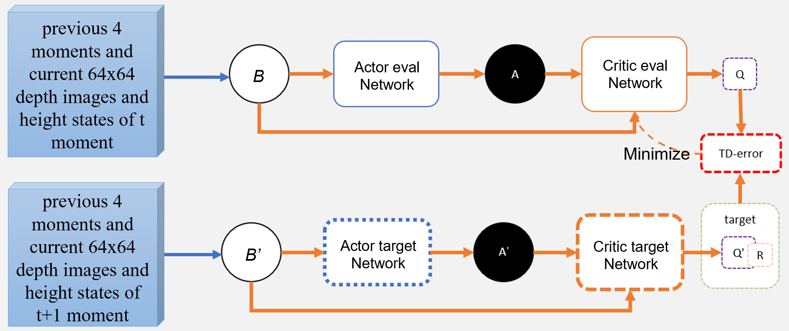
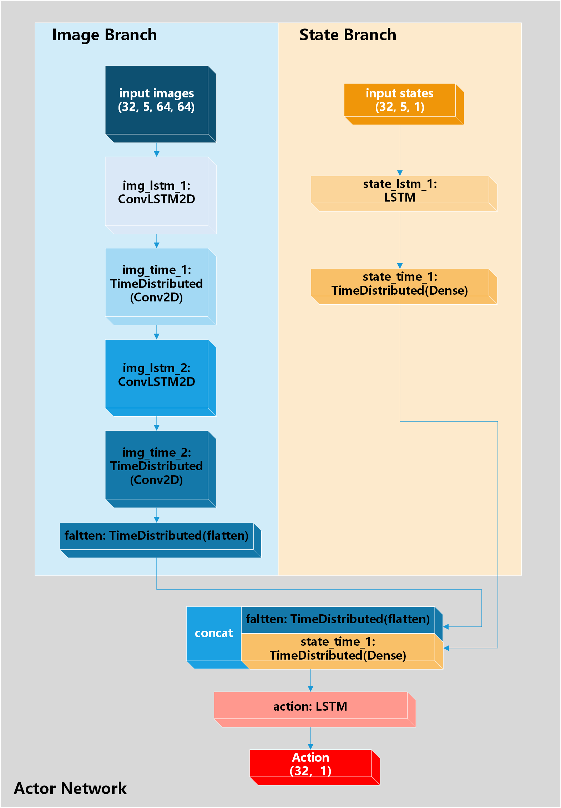
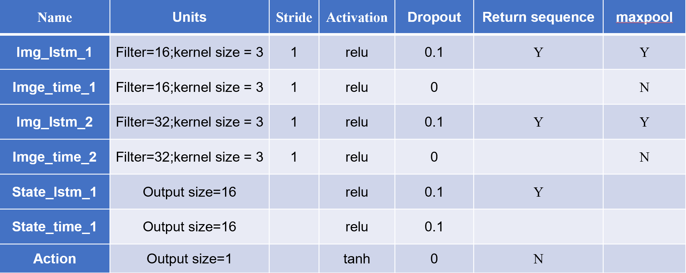
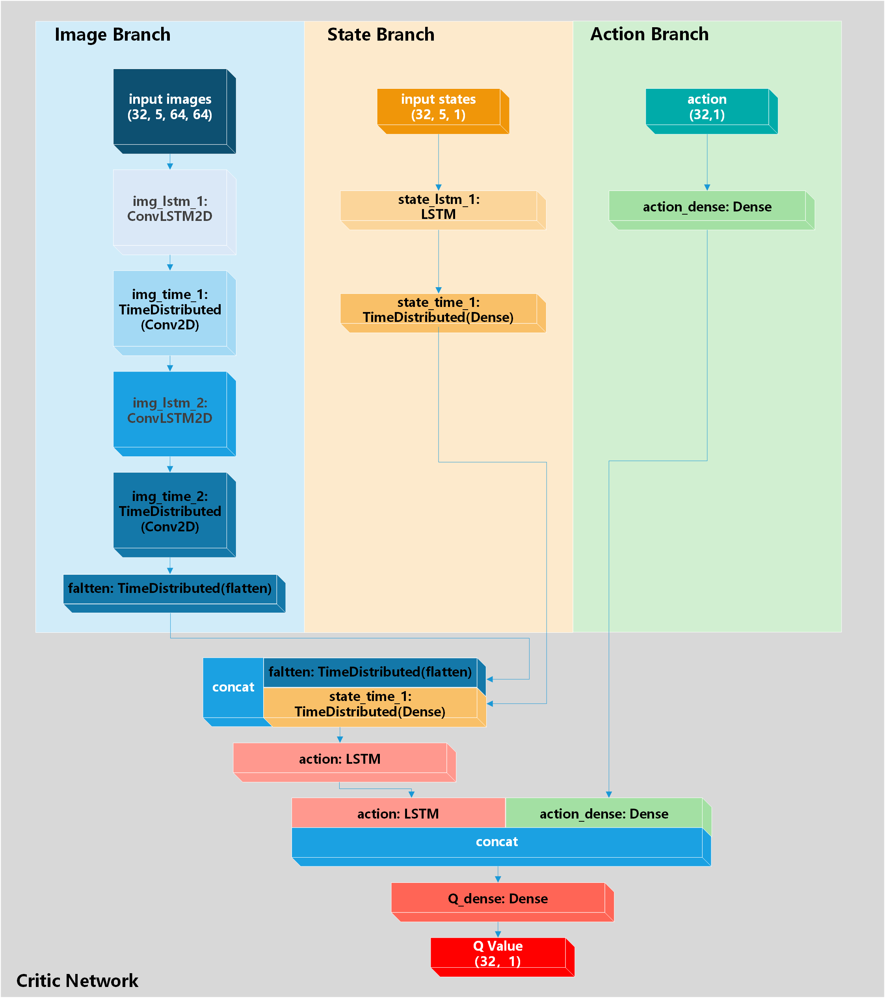
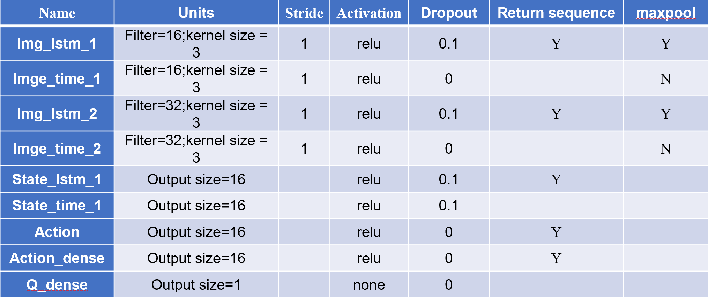

# DDPG-AirSim-Drone-Obstacle-Avoidance
Using DDPG and ConvLSTM to control a drone to avoid obstacle in AirSim

This project is developed based on [Microsoft-Airsim](https://github.com/microsoft/AirSim), achieving obstacle avoidance in height direction.

# Requirements
python == 3.6.2

AirSim == 1.2.0

Keras == 2.1.6

msgpack-rpc-python 0.4.1

numpy == 1.16.0

tensorflow == 1.8.0

pillow == 8.4.0

opencv-python == 3.2.0.7

# Framework

## Actor-Network

- batch size is 32
- Input of the image branch is previous 4 moments and current 64x64 depth images
- Input of the state branch is previous 4 moments and current height states
- Output of the actor network is current height control instruction

## Critic-Network

- batch size is 32
- Input of the image branch is previous 4 moments and current 64x64 depth images
- Input of the state branch is previous 4 moments and current height states
- Input of the action branch is previous 4 moments and current actions
- Output of the critic network is Q value

# how to use it
1. run `AirSim` to start the simulation enviroment
2. run `main.py` to train it
3. run `test.py` to test it

# If you find my work useful for your research, please give me a star!
I just did it for a course design task of `Artificial Neural Network and Control`, a master degree course, so there are certainly many bugs and I didn't finetune it.
If you want to do some research based on it, you could contact me and we could do it together!
