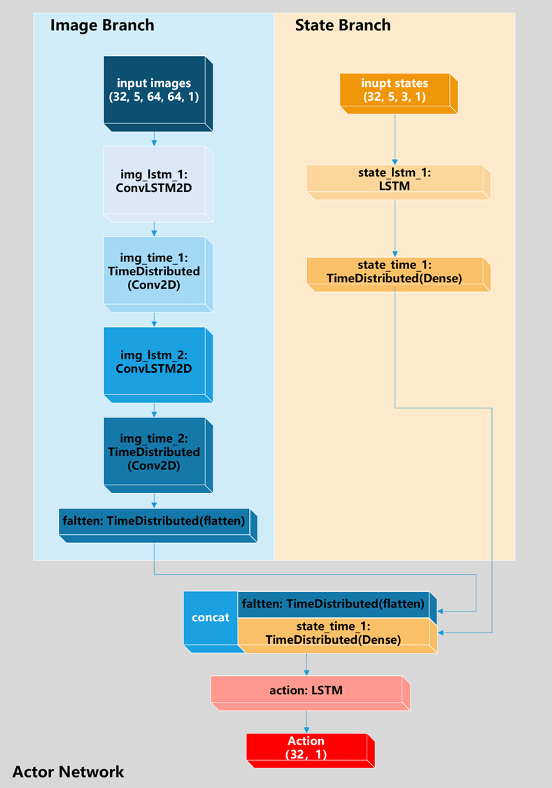
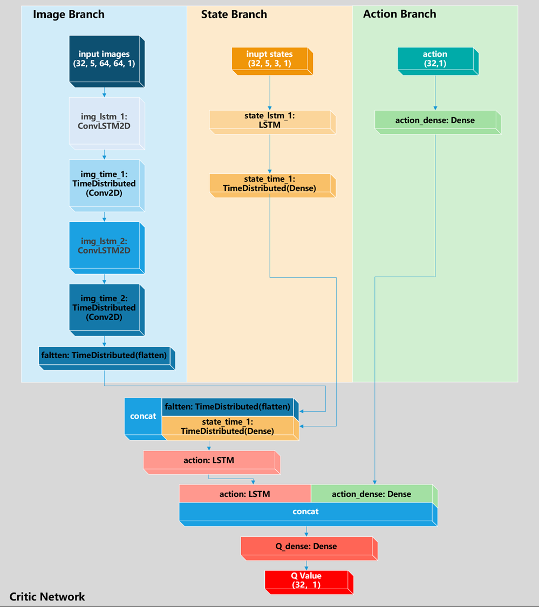

# AirSim-Drone-Obstacle-Avoidance
Using DDPG and ConvLSTM to help drone avoid obstacle in AirSim

This project is developed based on [Microsoft-Airsim](https://github.com/microsoft/AirSim).

# Requirements
python == 3.6.2

AirSim == 1.2.0

Keras == 2.1.6

msgpack-rpc-python 0.4.1

numpy == 1.16.0

tensorflow == 1.8.0

pillow == 8.4.0

opencv-python == 3.2.0.7

# Actor-Network

# Critic-Network

# how to use it
1. run `AirSim` to start the simulation enviroment
2. run `main.py` to train it
3. run `test.py` to test it

# If you find our work useful for your research, please give us a star!
